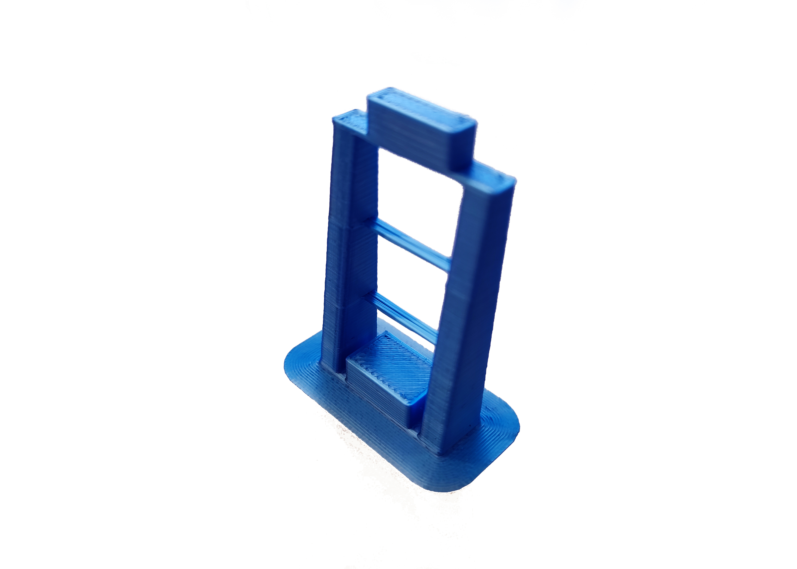

# Print the plastic parts

{{BOM}}

[PLA filament]: parts/materials/pla_filament.md "{cat:material}"
[RepRap-style printer]: parts/tools/rep-rap.md "{cat:tool}"
[Precision wire cutter]: parts/tools/precision-wire-cutters.md "{cat:tool}"
[Utility knife]: parts/tools/utility-knife.md "{cat:tool}"
[leg test]:models/leg_test.stl "{previewpage}"

## Set your printer settings {pagestep}

Almost all station parts can be printed out of [PLA filament] on most [RepRap-style printers][RepRap-style printer]{qty:1}.

We recommend the following printer settings:

|Setting        |Value          |
|------------   |--             |
|Material       |PLA            |
|Material Temperature |Recommended by the PLA brand|
|Layer height   |0.2mm or less  |
|Infill         |Printer default or more|
|Brim           |Recommended for all parts|
|Slice gap closing radius |0.001mm |

Test whether your printer can print the pieces for this station or other open-source designs. Download and print the [leg test] file. This will only use about [5 grams of PLA][PLA filament]{qty: 5g}.

The result should look like this (this has been printed with a brim):

As a general rule, strength is more important than surface finish, so very thin layers (less than 0.15mm or so) are unlikely to result in a station that performs any better, though it may approve the appearance.

## Printing {pagestep}

Now you have tested your [3D printer][RepRap-style printer] and [filament][PLA filament]{qty: 200g, note:"Of any colour you want"} you can print the following parts:

### Syringe Pump

* [Back support]{output,qty:1}: [back-support.stl](models/back-support.stl){previewpage}
* [Carriage]{output,qty:1}: [carriage.stl](models/carriage.stl){previewpage}
* [Front support]{output,qty:1}: [front-support.stl](models/front-support.stl){previewpage}
* [Syringe holder]{output,qty:1}: [syringe-holders.stl](models/syringe-holders.stl){previewpage}
* [Hand knob]{output,qty:2}: [hand-knob.stl](models/hand-knob.stl){previewpage}

### Control Interface

* [Interface panel]{output,qty:1}: [interface-panel.stl](models/interface-panel.stl){previewpage}
* [LCD adapter]{output,qty:1}: [lcd-adapter.stl](models/lcd-adapter.stl){previewpage}
* [Interface base]{output, qty:1}: [interface-base.stl](models/interface-base.stl){previewpage}
* [Electronics holder]{output, qty:1}: [electronics-holder.stl](models/electronics-holder.stl){previewpage}
* [Back cover]{output, qty:1}: [interface-back-cover.stl](models/interface-back-cover.stl){previewpage}

## Clean-up of printed parts {pagestep}

>!! **Be careful when removing brim:** To avoid injury, first remove the bulk of the brim without a knife. Remove the remaining brim with a peeling action as described below.

Carefully remove the printing brim from all parts. To remove brim:

1. Use [precision wire cutters][Precision wire cutter]{qty: 1} to remove most of the brim from the part.
2. Clean up the remaining brim with a [utility knife][Utility knife]{qty: 1, note: "Not a scalpel!"}:
    * Hold the knife in your dominant hand with 4 fingers curled around the handle, leaving your thumb free.
    * Hold the part in your other hand, as far away from the surface, to be cut as possible.
    * Support the part with the thumb of your dominant hand.
    * Place the blade on the surface to be cut, and carefully close your dominant hand, moving the blade, under control, towards your thumb.

