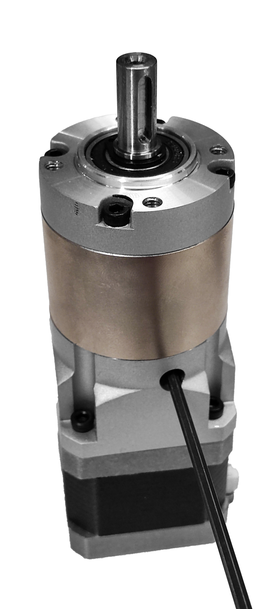
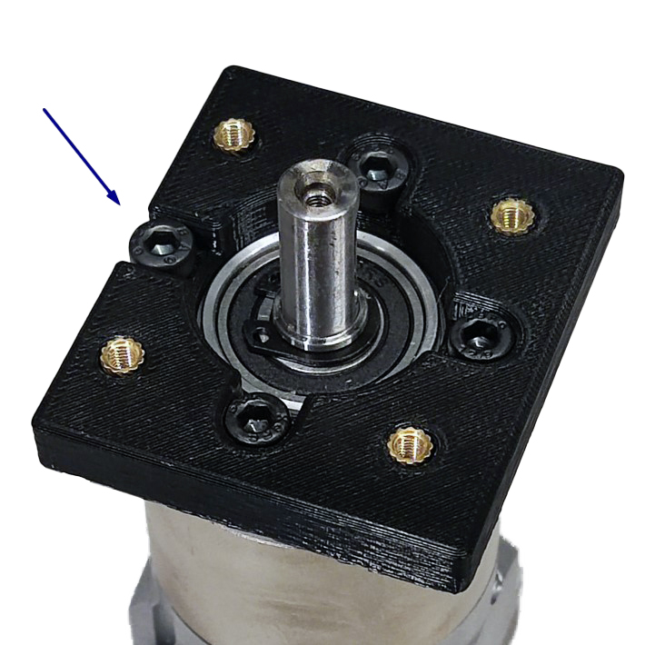
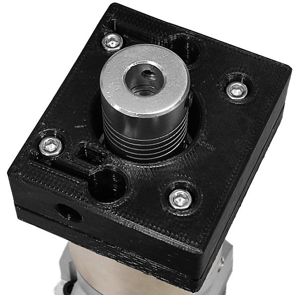
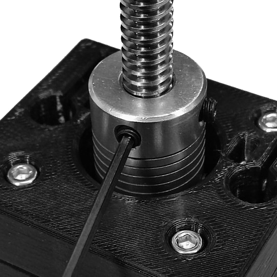
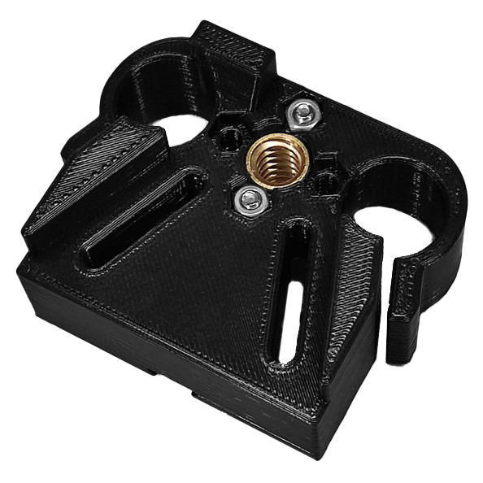
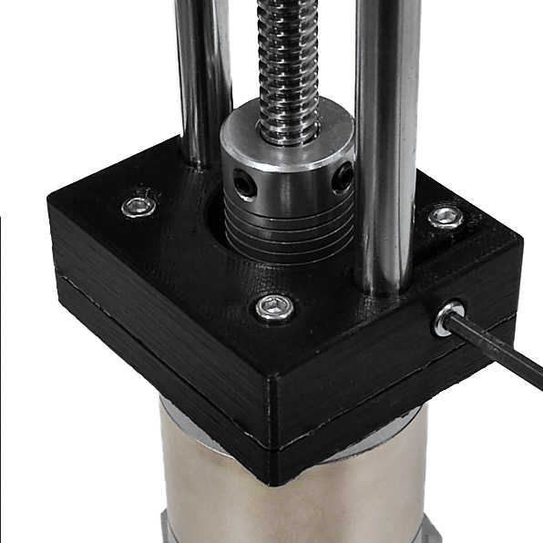
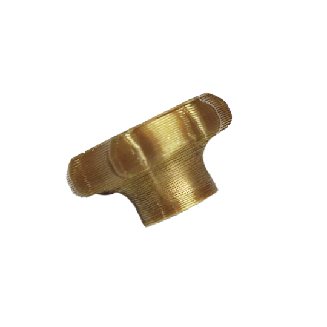
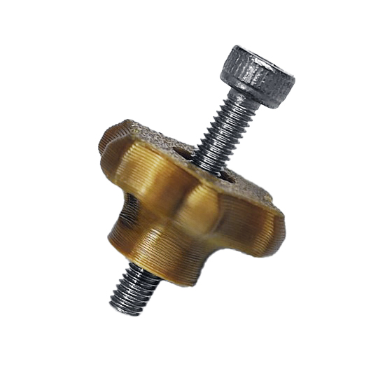
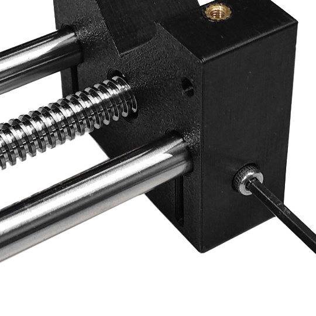
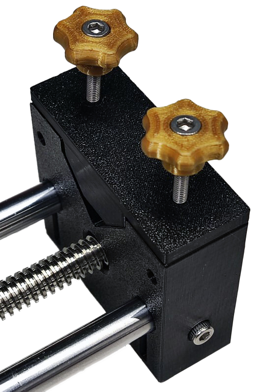

# Build syringe pump 

*This design is based on the [Open-Source Syringe Pump](https://www.mass-spec.ru/projects/diy/syringe_pump/eng/) developed by Andrey Samokhin*

Before you start building the station, you will need to source all the components listed in our [bill of materials]{BOM}, which is given on the next page.

{{BOM}}

[M2.5 hex key]: parts/tools/2mmBallEndAllenKey.md "{cat:tool}"
[M3 hex key]: parts/tools/2.5mmBallEndAllenKey.md "{cat:tool}"
[M4 hex key]: parts/tools/3mmBallEndAllenKey.md "{cat:tool}"
[Soldering iron]: parts/tools/soldering-iron.md "{cat:tool}"

[NEMA 17 motor]: parts/elect/NEMA-17-motor.md "{cat:elect}"

[Heat insert]: parts/mech/heat-insert.md "{cat:mech}"
[Lead screw]: parts/mech/lead-screw.md "{cat:mech}"
[Lead screw nut]: parts/mech/lead-screw-nut.md "{cat:mech}"
[Linear bearing]: parts/mech/linear-bearing.md "{cat:mech}"
[Linear motion rods]: parts/mech/linear-motion-rods-200mm.md "{cat:mech}"

[M3 8mm screw]: parts/mech/M3-8.md "{cat:mech}"
[M3 10mm screw]: parts/mech/M3-10.md "{cat:mech}"
[M3 12mm screw]: parts/mech/M3-12.md "{cat:mech}"
[M3 16mm screw]: parts/mech/M3-16.md "{cat:mech}"
[M3 20mm screw]: parts/mech/M3-20.md "{cat:mech}"
[M4 10mm screw]: parts/mech/M4-10.md "{cat:mech}"
[M3 nut]: parts/mech/nuts.md "{cat:mech}"
[Motor coupling]: parts/mech/motor-coupling.md "{cat:mech}"
[Planetary gearbox 100:1]: parts/mech/planetary-gearbox-100-1.md "{cat:mech}"

[Back support - A]: models/back-support-gearbox-A.stl "{previewpage}"
[Back support - B]: models/back-support-gearbox-B.stl "{previewpage}"
[Carriage]: models/carriage.stl "{previewpage}"
[Front support]: models/front-support.stl "{previewpage}"
[Hand knob]: models/hand-knob.stl "{previewpage}"
[Syringe holder]: models/syringe-holders.stl "{previewpage}"

>i **You should build two syringe pumps for droplet microfluidic assays**

## Assemble the stepper motor and gearbox {pagestep}

Insert the motor shaft of the [NEMA 17 motor]{Qty: 1} to the [gearbox][Planetary gearbox 100:1]{Qty: 1} and attach it to the housing by using four [M3 8mm][M3 8mm screw]{Qty: 4}. Use a [M3 hex key]{Qty: 1} to tighten them.

Then, use the same hex key to tighten the two clamp screws inside the gearbox to connect the motor shaft to the gears. Make sure one of the clamp screws is aligned with the flat on the motor shaft if yours has one. 

## Assemble the gearbox, back support, and lead screw {pagestep}

Grab the [back support - A][Back support - A]{Qty:1, Cat: printedparts}, take four [heat insert][Heat insert]{Qty:4} and positionate them in each hole of this printed part as shown below. Apply heat to each insert (using a [soldering iron][Soldering iron]{Qty:1}) and use gentle force to push it into position, as described in the [guide to use heat-set inserts].

Take four [M4 10mm][M4 10mm screw]{Qty: 4} and a [M4 hex key]{Qty: 1} key to tighten the [back support - A][Back support - A] to the gearbox. Make sure the piece orientation is correct. The indicated screw must be opposite to the electrical connector of the stepper motor.

Insert the shaft of the [gearbox][Planetary gearbox 100:1] halfway into the [motor coupling][Motor coupling]{Qty: 1} and then tighten down to it. Use a [M2.5 hex key]{Qty: 1} to tighten the motor coupling. 

Take four [M3 16mm][M3 16mm screw]{Qty: 4} to tighten the [back support - B][Back support - B]{Qty:1, Cat: printedparts} to the part A. Make sure the screw holes on the back support B are aligned to the heat inserts.

Take the [lead screw][Lead screw]{Qty: 1}, and insert it into the motor coupling. Then, tighten the motor coupling down on the lead screw.

Take two [M3 nut]{Qty: 2}, insert them on the [back support - B][Back support - B] and push them in. Feel free to grab whatever tools you need to push them in. Make sure they align with the screw holes on the back support. Then, take two [M3 10mm][M3 10mm screw]{Qty: 2} and screw them just to hold the nuts. Use a [M3 hex key].

## Assemble and mount the carriage {pagestep}

Insert the [lead screw nut][Lead screw nut]{Qty: 1} into the [carriage][Carriage]{Qty:1, Cat: printedparts} and tighten it to the carriage using two [M3 16mm][M3 16mm screw]{Qty: 2} and two [M3 nut]{Qty: 2}. Insert the screws in opposite side to hold the lead screw nut properly.

Grab the [carriage][Carriage] and take the [linear bearing][Linear bearing]{Qty:2} and insert them into the side of the carriage. Then, take two [M3 nut]{Qty: 2} and insert them on the carriage and push then in. Feel free to grab whatever tools you need to push them in. Make sure they align with the screw holes on the carriage. Take two [M3 12mm][M3 12mm screw]{Qty: 2} and a M3 hex key to tighten the linear bearings.

Insert the lead screw into the nut. Then, manually thread it up to the middle of the lead screw as shown below.

Push the [linear rails][Linear motion rods]{Qty: 2} into the linear bearings in the [carriage] and insert them in the [back support - B][Back support - B], one into the left side and one to the right side. Make sure they are inserted into the holes properly and then push them through. Tighten the linear rails down on the back support - B.

## Assemble the front support, hand knobs, and syringe holder {pagestep}

Grab the [front support][Front support]{Qty:1, Cat: printedparts}, take two [heat insert][Heat insert]{Qty:2} and positionate them in each hole of the front support. Apply heat to each insert (using a [soldering iron][Soldering iron]{Qty:1}) and use gentle force to push it into position, as described in the [guide to use heat-set inserts].

Insert [M3 nuts][M3 nut]{Qty: 2} into the nut traps of the front support. Feel free to grab whatever tools you need to push them in. Make sure they align with the screw holes on the front support. Take [M3 16mm][M3 16mm screw]{Qty: 2} and thread them enough to hold the nuts.

Insert a [M3 nut]{Qty: 1} into the nut trap of the [hand knob][Hand knob]{Qty:2, Cat: printedparts}. Take a [M3 20mm][M3 20mm screw]{Qty: 2} and thread it all. Repeat this step with the second knob.

## Assemble the front support and the linear rails {pagestep}

Align the linear rails with the front support to make it sure that they insert into the holes properly, and then push them through. Tighten the linear rails down on the front support.

Finally, grab the [syringe holder][Syringe holder]{Qty:1, Cat: printedparts} and place it into the front support. Make sure the screw holes from both parts are aligned. Take the two knobs and thread them a bit.

Your syringe pump is ready to be used.

[guide to use heat-set inserts]: https://hackaday.com/2019/02/28/threading-3d-printed-parts-how-to-use-heat-set-inserts/